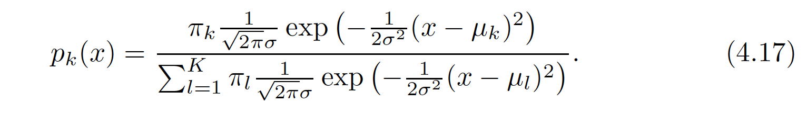

## \>Q Conceptual exercise

It was stated in the textbook - `it is not hard to show` that classifying an observation to the class for which (4.17) is largest is equivalent to classifying an observation to the class for which (4.18) is largest.

I hate it when math people do that ... but let's try to do just that because there is actually a few intuitions to be gained once we digest the notations and what they actually mean.

We will do that by looking closely at the ingredients $f_k(x)$ and $\pi_k$ in the simplest case where we do LDA with $p=1$ predictor.

The goal is to show with pencil and paper that maximizing the discriminant function $\delta_k(x)$ amounts to maximizing the posterior probability $p_k(x)$

Our assumptions are that the observations in the kth class are drawn from a $N(μ_k,\sigma^2)$ distribution, the Bayes classifier assigns an observation to the class for which the discriminant function is maximized

**Hint**: read back the section `4.4.1 Linear Discriminant Analysis for p = 1` and recognize that although this expression below looks:



But a few tricks can come handy ..

A first trick is that there are a **lot of ugly terms that are actually constants** there. In particular remember that the bulky denominator that looks very intimidating is really $p(x)$ so **it is actually a constant** that carries no information of which $p_k(x)$ is bigger.

The second trick is to take `log()` because we can get rid of $exp(...)$ and taking log() of two expression is legit because you still get the max at the same location (we do that all the time when doing likelihood functions).

The last trick is to develop the $(x - \mu_k)^2$ term as and to recognize again what are terms that depend on $x$ only .. because these can also be seen as constant once you get a given x value there is no information on how to classify

Answered in Obsidian.

## \>Q Implement & compare 2 methods (QDA/LDA/Naive Bayes) with your previous classifier

Compare the performance of LDA QDA and the method we have used for last week (i.e. logistic regression) for making predictions on the TCGA dataset.

Compare their ability to classify `Normal/Cancer` by using the same set of predictors as the one you used for your logitic regression model.

Note you could use any predictors from the TCGA dataset (i.e. individual gene expression predictors and/or PC1, PC2 & PC3).

If you want to look at visuals on LDA predictions check the penguin example file posed on **Brightspace**.

## \>Q use cross validation to check how accurate are the predictions you make with LDA and QDA

```{r}
library(MASS)
library(tidyverse)

# --- 1. DATA LOADING ---
tcgadf <- read_rds("data/TCGA_cancer_classification/miniTCGA.3349x4006.rds") 

# Transform response to binary (1 for Tumor, 0 for Normal)
tcgadf <- tcgadf %>%
  mutate(sampletype = response, 
         response = ifelse(response == "Tumor", 1, 0))

# --- 2. DATA CLEANING ---
# We create a clean dataset specifically for these 3 genes to avoid length mismatches
tcgadf_clean <- tcgadf %>%
  filter(!is.na(`ANGPTL1.9068`), 
         !is.na(`NR3C2.4306`), 
         !is.na(`TMEM220.388335`),
         !is.na(response))

print(paste("Total samples for analysis:", nrow(tcgadf_clean)))

# --- 3. LDA MODEL WITH CROSS-VALIDATION ---
# Setting CV = TRUE tells R to run the model multiple times, leaving one sample out each time
lda_cv <- lda(response ~ `ANGPTL1.9068` + `NR3C2.4306` + `TMEM220.388335`, 
              data = tcgadf_clean, 
              CV = TRUE)

# With CV = TRUE, the output is directly the predictions
lda_cv_class <- lda_cv$class
lda_cv_table <- table(Predicted = lda_cv_class, Real = tcgadf_clean$response)
lda_cv_acc   <- sum(diag(lda_cv_table)) / sum(lda_cv_table)

# --- 4. QDA MODEL WITH CROSS-VALIDATION ---
qda_cv <- qda(response ~ `ANGPTL1.9068` + `NR3C2.4306` + `TMEM220.388335`, 
              data = tcgadf_clean, 
              CV = TRUE)

qda_cv_class <- qda_cv$class
qda_cv_table <- table(Predicted = qda_cv_class, Real = tcgadf_clean$response)
qda_cv_acc   <- sum(diag(qda_cv_table)) / sum(qda_cv_table)

# --- 5. FINAL COMPARISON ---
print("--- CROSS-VALIDATED RESULTS ---")
print(paste("LDA CV Accuracy:", round(lda_cv_acc, 4)))
print(paste("QDA CV Accuracy:", round(qda_cv_acc, 4)))

# --- 6. LOGISTIC REGRESSION ---
logit_model <- glm(response ~ `ANGPTL1.9068` + `NR3C2.4306` + `TMEM220.388335`, 
                   data = tcgadf_clean, 
                   family = binomial)

logit_probs <- predict(logit_model, type = "response")

logit_class <- ifelse(logit_probs > 0.5, 1, 0)

logit_table <- table(Predicted = logit_class, Real = tcgadf_clean$response)
logit_acc   <- sum(diag(logit_table)) / sum(logit_table)

print(paste("Logistic Regression Accuracy:", round(logit_acc, 4)))
```

## \>Q Get ready to submit your best predictions as a TEAM

-   Remember that preds are using a rds format

-   Remember to check the actual format of your rpedictiosn

Now you are ahead of the next assignment :0).
